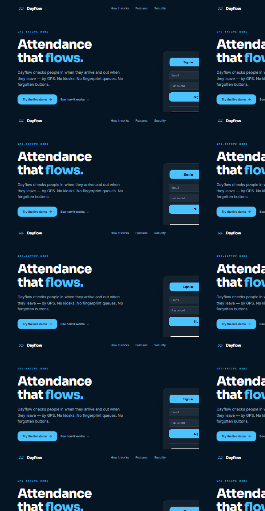
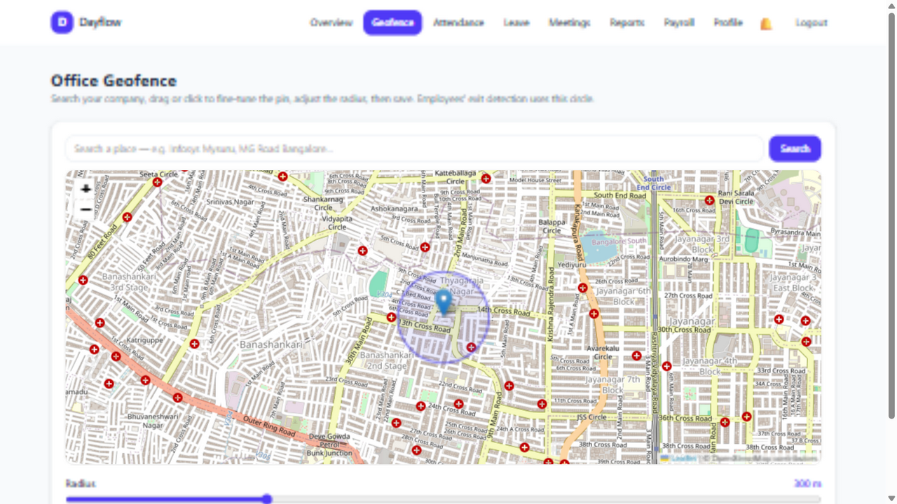
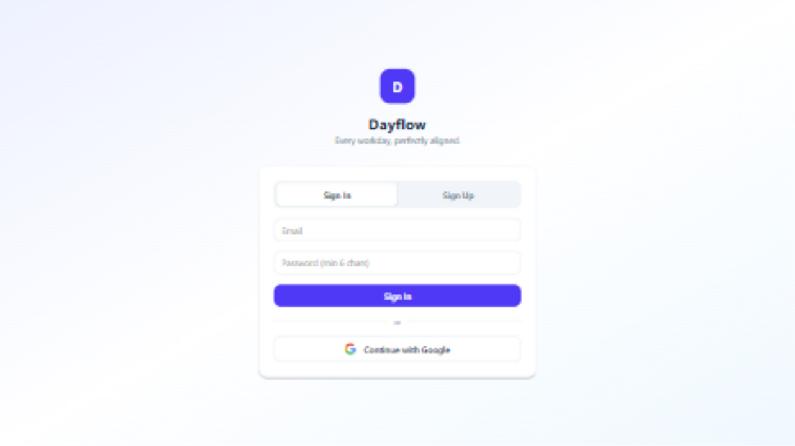
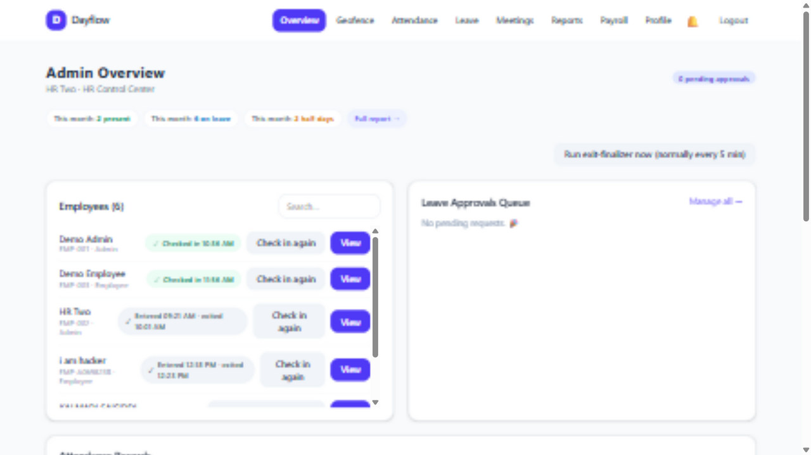
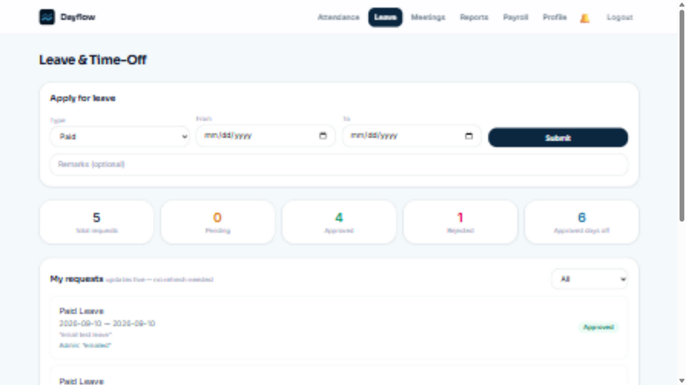
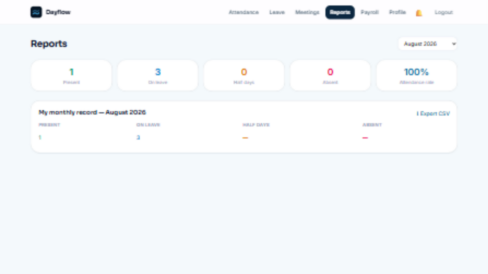
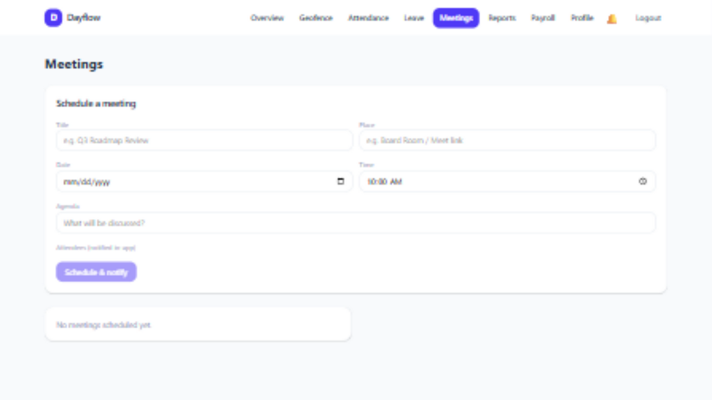

<div align="center">

# 🌊 Dayflow

### Every workday, perfectly aligned.

**A modern Human Resource Management System where attendance takes care of itself.**

[](https://react.dev)
[](https://www.typescriptlang.org)
[](https://fastapi.tiangolo.com)
[](https://supabase.com)
[](https://tailwindcss.com)
[](LICENSE)

**Walk into the office → checked in. Walk out → checked out. Zero touches.**

</div>

---



---

## 🛰️ The Differentiator — GPS-Only Attendance

Most HRMS apps stop at a manual check-in button people forget to press. Dayflow rethinks attendance as **presence, not paperwork**:

| | Traditional HRMS | Dayflow |
|---|---|---|
| **Entry** | Fingerprint scanner / manual button | 🛰️ Automatic — first GPS presence inside the office geofence checks you in |
| **Exit** | A check-out button nobody presses | 🛰️ Geofence exit detection with a **15-minute grace window** (lunch runs don't count) |
| **Short days** | Manual HR correction | 🧠 **Half-day intelligence** — leave before 4 worked hours, auto-marked `half_day` |
| **Closed tab?** | Tracking lost | 🤖 Server-side finalizer runs every 5 min as a safety net |

The whole pipeline runs on the **haversine formula** against an admin-configurable office geofence — and the admin sets that geofence **on a live map**:



> Search your company, drag the pin, slide the radius (50–1000 m), save. Every employee's check-in/out boundary updates instantly.

---

## ✨ Feature Tour

### 🔐 Authentication & Access Control
- **Email + password sign-up** with mandatory **email verification** (Supabase Auth)
- **Google OAuth** one-click sign-in — avatar and employee ID auto-provisioned
- **Role-based access** (Employee / Admin-HR) enforced at **three layers**: UI, API, and **Postgres Row-Level Security** — an employee's database token literally cannot read another employee's row
- Admin sign-up protected by a secret code — no self-promotion to HR

### 🕐 Attendance
- **Automatic GPS check-in/out** with live status indicator — *Present · Pending exit · Checked out* — pulsing in real time
- Daily & weekly views with **entry/exit source tags** (GPS vs legacy)
- Live distance readout ("247 m from office") on the employee dashboard
- **On-leave days trace their source** — every mark cites the exact approved request

### 🌴 Leave & Time-Off
- Apply with type (Paid/Sick/Unpaid), date range, remarks
- **Realtime approval workflow** — admin decides, employee's dashboard updates *without refresh* (Supabase Realtime)
- **Rejection reverts attendance** — un-approve a leave and its `on_leave` marks roll back automatically (overlap-safe)
- **Leave analytics**: per-employee totals, pending/approved/rejected counts, approved days off

### 👥 Meetings & Notifications (beyond the SRS)
- Admin schedules meetings with **attendees, agenda, date, time, place**
- Invitees get notified through **three channels simultaneously**:
  - 🔔 **In-app bell** — live red badge via Realtime
  - 🖥️ **Native browser notifications** — desktop toasts, even in a background tab
  - 📧 **Real email** — branded HTML invites via Resend (leave approvals/rejections email too)

### 💰 Payroll
- Read-only employee view with monthly breakdown
- Admin editor with **live net-salary computation** (base + allowances − deductions)
- 🖨️ **One-click payslip** — formatted, print-ready / save-as-PDF

### 📊 Reports & Analytics
- Monthly attendance dashboard: Present / On-leave / Half-days / Absent / **attendance rate %**
- Per-employee monthly breakdown for admins
- **CSV export** with one click
- Summary strips live on both dashboards

### 👤 Profiles
- View personal, job, salary details with avatar
- Employees edit only phone/address/photo; admins edit everything — enforced server-side

<details>
<summary><b>📸 More screenshots</b></summary>

<br/>

**Sign-in — email + Google OAuth:**



**Admin control center:**



**Leave management with live statistics:**



**Monthly reports:**



**Meetings with attendee invites:**



</details>

---

## 🏗️ Architecture

```
┌─────────────────────┐         ┌──────────────────────┐
│   React + Vite      │  HTTPS  │   FastAPI (Python)   │
│   TypeScript        │ ──────► │   JWT validation     │
│   Tailwind CSS      │         │   Geofence engine    │
│                     │         │   Email (Resend)     │
│  Realtime ◄─────────┼─────────┼──► Supabase          │
│  (leave/meetings)   │         │   • Postgres + RLS   │
└─────────────────────┘         │   • Auth (email/Google)
                                │   • Realtime engine   │
        📱 Browser GPS ────────►└──────────────────────┘
           (geofence pings)
```

| Layer | Tech | Why |
|---|---|---|
| Frontend | React 18 + Vite + TypeScript + Tailwind v4 | Fast, type-safe, zero-config styling |
| Backend | FastAPI | Async, typed, auto-documented (`/docs`) |
| Database | Supabase Postgres | Row-Level Security = defense in depth |
| Auth | Supabase Auth | Email verification + Google OAuth out of the box |
| Realtime | Supabase Realtime | Leave status & meeting invites without refresh |
| Geolocation | Browser Geolocation API | Haversine distance vs configurable geofence |
| Email | Resend API | Real HTML email for invites & approvals |

---

## 🚀 Quickstart

### 1 · Supabase
```bash
# create a project at supabase.com, then in the SQL editor run:
supabase/schema.sql          # tables, RLS policies, triggers, realtime
```

### 2 · Backend
```bash
cd backend
python -m pip install -r requirements.txt
cp .env.example .env         # add SUPABASE_URL, SERVICE_ROLE_KEY,
                             # ADMIN_SIGNUP_CODE, RESEND_API_KEY (optional)
python -m uvicorn app.main:app --reload
```

### 3 · Frontend
```bash
cd frontend
npm install
cp .env.example .env         # add SUPABASE_URL, ANON_KEY, API_URL
npm run dev                  # → http://localhost:5173
```

> Email note: without a `RESEND_API_KEY`, emails run in **dry-run mode** (logged to the backend console) — everything else works fully.

---

## 🎬 60-Second Demo Script

1. **Sign in** as admin (`hr2@dayflow.test` / `Hr#12345`) → the HR control center: live check-in chips, pending-approval badge, org-wide attendance stats
2. **Open the Geofence page** → search a landmark, drag the pin, adjust the radius → *attendance boundaries update for everyone, instantly*
3. In another window, sign in as an **employee** → the live indicator shows their real GPS distance from the office
4. Employee **applies for leave** → it appears in the admin queue *in real time* → **Approve** → the employee's dashboard flips to Approved *without refresh*, the dates become `On leave` in attendance, and an **email lands in their inbox**
5. **Reject** it → the `On_leave` marks **roll back automatically**
6. Admin **schedules a meeting** → the employee's 🔔 bell lights up, a browser notification pops, and the invite email arrives
7. Employee → **Reports**: monthly stats, attendance rate, CSV export → **Payroll**: one-click **payslip**

---

## 🔐 Security Model

- **Row-Level Security** on every table — the database itself enforces "employees see only their own data"
- FastAPI validates every Supabase JWT server-side; the service-role key never leaves the backend
- Admin-only routes gated at API level (`403` on any attempt) *and* in the router
- Admin sign-up requires a secret code — role escalation is impossible via the UI

---

## 📁 Project Structure

```
dayflow/
├── backend/            # FastAPI service
│   └── app/main.py     # auth, profiles, attendance/geofence engine,
│                       # leave, payroll, meetings, email, reports
├── frontend/           # React + TypeScript + Tailwind
│   └── src/
│       ├── pages/      # dashboards, attendance, leave, meetings,
│       │               # payroll, reports, geofence editor, auth
│       ├── components/ # layout, notification bell, UI kit
│       └── lib/        # supabase client, API wrapper, geofence hook
├── supabase/           # schema.sql + numbered migrations
└── docs/screenshots/   # the images above
```

---

## 🗺️ Roadmap

- [ ] True background geofencing via native apps (Android Geofencing API / iOS region monitoring)
- [ ] SMS notifications alongside email
- [ ] Payroll tax rules & historical payslips
- [ ] Calendar view with meeting reminders

---

<div align="center">

**Built overnight, tested live end-to-end — GPS, realtime, and email verified in a real browser.**

⭐ Star the repo if Dayflow made you rethink attendance.

</div>
